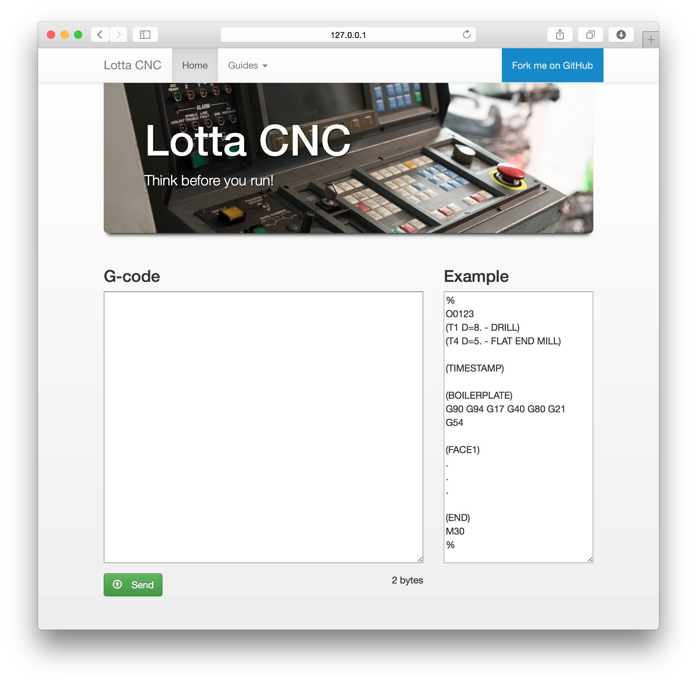

# lottacnc

## Moxa
Moxa server runs Lotta CNC flask application and the moxa configurations are on service-config -folder. 
- `flask-application`   
- `service-config`

For serial comms settings, set Lotta parameters 552 and 553 to 11 for 9600 bps speed.  On Moxa side, set /opt/lottacnc/settings.py respectively.

## Lotta programs
`nc-programs` -folder contains NC programs for tool length setting and 3dtaster usage. 

File | Lotta program | Description
---- | ------------- | -----------
3dtastertest.nc | `O0002` | 3dtaster indicator
tool-length.nc   | `O0001` | piippari -lenght calibration method 
tool-length.nc | `O0003` | 5mm stock -lenght calibration method 
 

